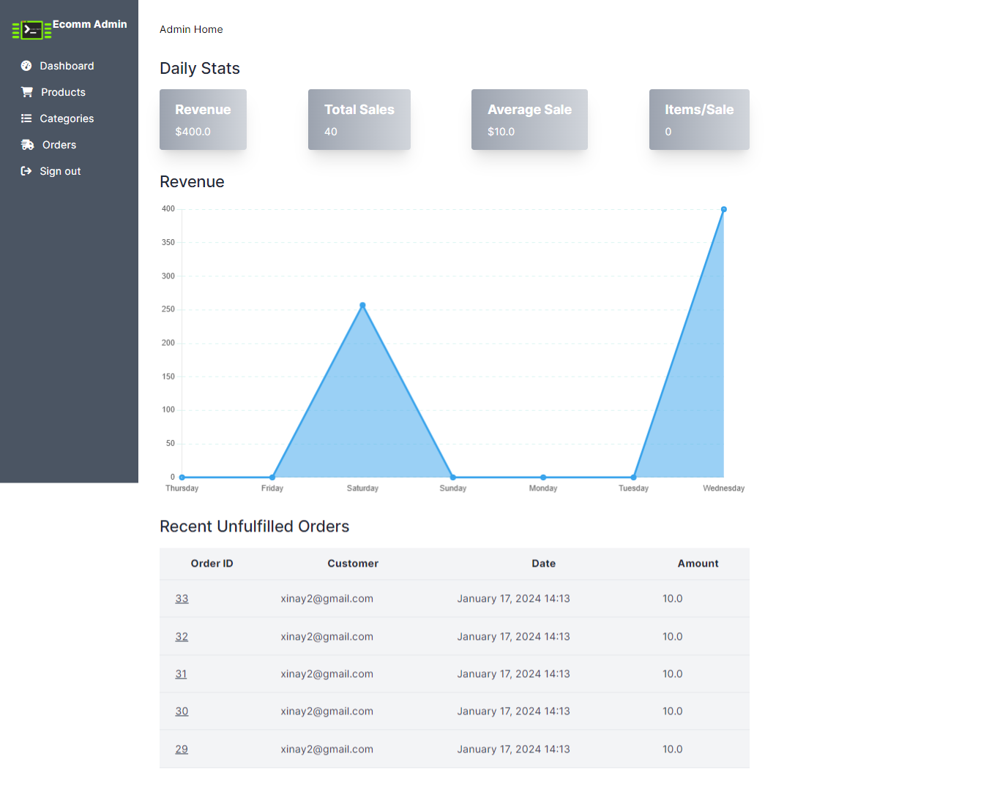

# fullstack e-commerce   con rails 
img_demo

* Ruby version
```bash
ruby 3.3.0
```
* versión de rails 
```bash
rails 7.1.2
```
* Instalar las dependencias
```bash
bundle install
```
* Crear la migración 
```bash
rails db:migrate
```
* Correr el proyecto
```bash
rails s
```

## apuntes
### para crear admin 
```bash
rails generate Admin
```
### para crear un usuario admin desde consola de rails 
```bash
rails c
```
```bash
Admin.create(email: 'admin@example.com', password: 'password')
```
```bash
rails s
```
### ruta por defecto de admin 
```bash
127.0.0.1:3000/admins/sign_in
```
### instalar active storage
```bash
rails active_storage:install
```
## migrar nuevamente 
```bash
rails db:migrate
```
## para error de proceso de imagen en windows
crearse una carpeta en el disco c con el nombre de RubyVips y luego ejecutar como administrador desde powershell
```bash
gem install ruby-vips --install-dir=C:/RubyVips
```
y luego reforzar en instalar nevamente en la consoal del proyecto
```bash
gem install ruby-vips
```
## para relacionar tablas
```bash
rails g scaffold admin::stock 
size:string amount:integer product:references
```

Para usar diseños con chart.js hay que instalar y luego generar stimulus 
```bash
npm install chart.js 
```
```bash
rails g stimulus dashboard
```
Para crear motorbase de datos 
```bash
rails db:system:change --to=postgresql
```


